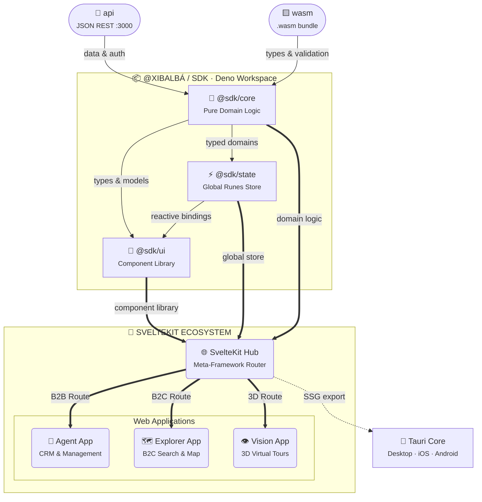

# Client Architecture Diagram

```mermaid
graph TD
    %% ── SERVER OUTPUTS (consumed) ───────────────────────────
    Api(["🚀 api<br/><small>JSON REST :3000</small>"]):::server
    Wasm(["🟨 wasm<br/><small>.wasm bundle</small>"]):::server

    %% ── LAYER 1: SDK ────────────────────────────────────────
    subgraph SDK ["📦 @XIBALBÁ / SDK  · Deno Workspace"]
        direction LR
        Core["📐 @sdk/core<br/><small>Pure Domain Logic</small>"]:::sdkCore
        State["⚡ @sdk/state<br/><small>Global Runes Store</small>"]:::sdkState
        UI["🧩 @sdk/ui<br/><small>Component Library</small>"]:::sdkUi
    end

    %% ── LAYER 2: SVELTEKIT ──────────────────────────────────
    subgraph ECOSYSTEM ["📱 SVELTEKIT ECOSYSTEM"]
        direction TB
        Hub("🌐 SvelteKit Hub<br/><small>Meta-Framework Router</small>"):::hub

        subgraph APPS ["Web Applications"]
            direction LR
            Agent("💼 Agent App<br/><small>CRM & Management</small>"):::app
            Explorer("🗺️ Explorer App<br/><small>B2C Search & Map</small>"):::app
            Vision("👁️ Vision App<br/><small>3D Virtual Tours</small>"):::app
        end
    end

    %% ── LAYER 3: NATIVE ─────────────────────────────────────
    Tauri["🦀 Tauri Core<br/><small>Desktop · iOS · Android</small>"]:::native

    %% ── FLOWS ───────────────────────────────────────────────
    Api -->|data & auth| Core
    Wasm -->|types & validation| Core

    Core -->|typed domains| State
    Core -->|types & models| UI
    State -->|reactive bindings| UI

    UI ==>|component library| Hub
    State ==>|global store| Hub
    Core ==>|domain logic| Hub

    Hub ==>|B2B Route| Agent
    Hub ==>|B2C Route| Explorer
    Hub ==>|3D Route| Vision

    Hub -.->|SSG export| Tauri
```