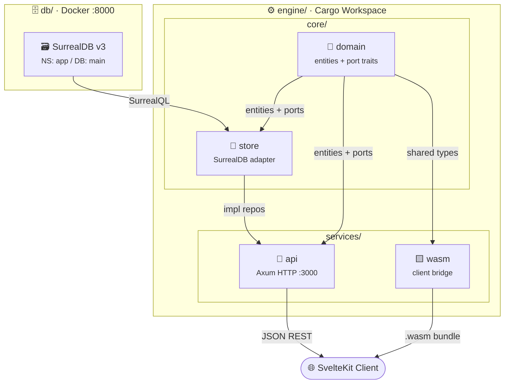

# Server Architecture Diagram

```mermaid
graph TD
    subgraph DB ["🗄️ db/  · Docker :8000"]
        SurrealDB["🗃️ SurrealDB v3<br/><small>NS: app / DB: main</small>"]:::db
    end

    subgraph ENGINE ["⚙️ engine/  · Cargo Workspace"]
        direction TB

        subgraph CORE ["core/"]
            direction LR
            Domain["📐 domain<br/><small>entities + port traits</small>"]:::domain
            Store["🔌 store<br/><small>SurrealDB adapter</small>"]:::store
        end

        subgraph SERVICES ["services/"]
            direction LR
            Api["🚀 api<br/><small>Axum HTTP :3000</small>"]:::api
            Wasm["🟨 wasm<br/><small>client bridge</small>"]:::wasm
        end
    end

    Client(["🌐 SvelteKit Client"]):::client

    SurrealDB -->|SurrealQL| Store
    Domain -->|entities + ports| Store
    Domain -->|entities + ports| Api
    Domain -->|shared types| Wasm
    Store -->|impl repos| Api
    Api -->|JSON REST| Client
    Wasm -->|.wasm bundle| Client
```