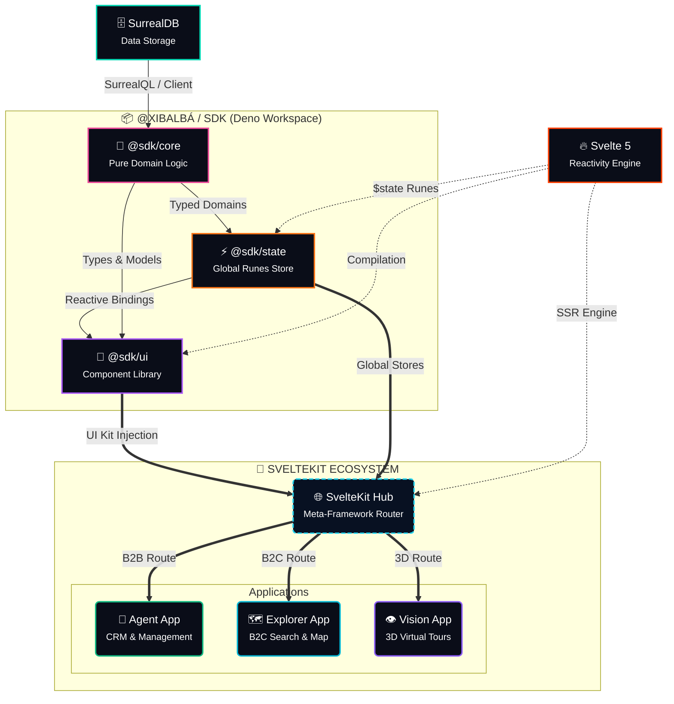

# Architecture Diagram

```mermaid
graph TD
    %% Global Styling
    classDef database fill:#0A0D18,stroke:#00D6B2,stroke-width:2px,color:#fff
    classDef sdkCore fill:#0A0D18,stroke:#EC4899,stroke-width:2px,color:#fff
    classDef sdkState fill:#0A0D18,stroke:#F97316,stroke-width:2px,color:#fff
    classDef sdkUi fill:#0A0D18,stroke:#A855F7,stroke-width:2px,color:#fff
    classDef svelte fill:#0A0D18,stroke:#FF3E00,stroke-width:2px,color:#fff
    classDef hub fill:#081122,stroke:#22D3EE,stroke-width:2px,color:#fff,stroke-dasharray: 6 3
    classDef appAgent fill:#0A0D18,stroke:#10B981,stroke-width:2px,color:#fff
    classDef appExp fill:#0A0D18,stroke:#06B6D4,stroke-width:2px,color:#fff
    classDef appVis fill:#0A0D18,stroke:#8B5CF6,stroke-width:2px,color:#fff

    %% Top Layer
    DB["🗄️ SurrealDB<br/><small>Data Storage</small>"]:::database
    Svelte["🔥 Svelte 5<br/><small>Reactivity Engine</small>"]:::svelte
    
    %% The SDK Cluster
    subgraph SDK ["📦 @XIBALBÁ / SDK (Deno Workspace)"]
        direction TB
        Core["🧠 @sdk/core<br/><small>Pure Domain Logic</small>"]:::sdkCore
        State["⚡ @sdk/state<br/><small>Global Runes Store</small>"]:::sdkState
        UI["🧩 @sdk/ui<br/><small>Component Library</small>"]:::sdkUi
    end

    %% The Application Ecosystem
    subgraph ECOSYSTEM ["📱 SVELTEKIT ECOSYSTEM"]
        direction TB
        Hub("🌐 SvelteKit Hub<br/><small>Meta-Framework Router</small>"):::hub
        
        subgraph APPS ["Applications"]
            direction LR
            Agent("💼 Agent App<br/><small>CRM & Management</small>"):::appAgent
            Explorer("🗺️ Explorer App<br/><small>B2C Search & Map</small>"):::appExp
            Vision("👁️ Vision App<br/><small>3D Virtual Tours</small>"):::appVis
        end
    end

    %% SDK Internal Flow
    DB -->|SurrealQL / Client| Core
    Core -->|Typed Domains| State
    State -->|Reactive Bindings| UI
    Core -->|Types & Models| UI

    %% Engine Injections
    Svelte -.->|$state Runes| State
    Svelte -.->|Compilation| UI

    %% Funneling into SvelteKit
    UI ==>|UI Kit Injection| Hub
    State ==>|Global Stores| Hub
    Svelte -.->|SSR Engine| Hub

    %% Branching to Apps
    Hub ==>|B2B Route| Agent
    Hub ==>|B2C Route| Explorer
    Hub ==>|3D Route| Vision
```
