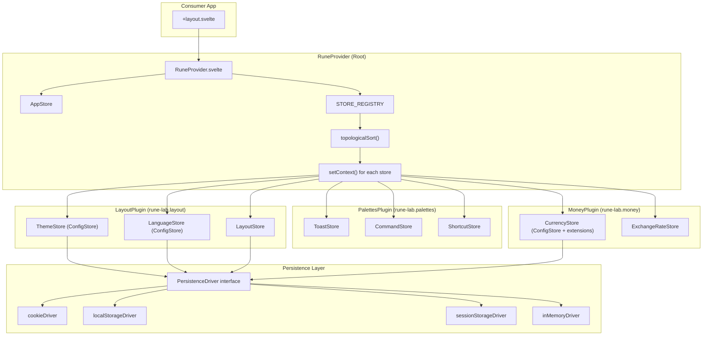

# Rune Lab — Technical Specification & Reverse-Engineering

> **Ground-truth implementation guide** — Feed this file to any LLM to enable accurate implementation, integration, and extension of the `rune-lab` library without hallucination.

---

## Metadata

| Field | Value |
|---|---|
| **Project Name** | `rune-lab` |
| **Type** | UI Component Library / Framework Shell |
| **Version** | `0.4.4` |
| **Primary Language** | TypeScript + Svelte 5 (Runes) |
| **Framework** | SvelteKit (adapter-static) |
| **Styling** | Tailwind CSS v4 + DaisyUI |
| **i18n** | Paraglide JS (@inlang) — 13 languages |
| **Build System** | Vite (via `vite-plus`), `@sveltejs/package` for dist |
| **Package Manager** | Bun / npm |
| **Task Runner** | `just` (justfile) |
| **Test Framework** | Vitest (`vite-plus/test`) + `@testing-library/jest-dom` |
| **License** | MIT — Fernando Bryan Reza Campos |
| **NPM** | `rune-lab` |
| **JSR** | `@yrrrrrf/rune-lab` |
| **Entry Point** | `src/lib/mod.ts` → re-exports all public API |
| **Repository** | `github.com/Yrrrrrf/rune-lab` |

---

## Architecture Overview

Rune Lab is a **plugin-based UI shell** for Svelte 5 applications. It provides a complete application skeleton with layout, theming, i18n, keyboard shortcuts, command palette, toast notifications, and a money/currency subsystem — all wired through a centralized **Provider + Registry + Context** architecture.

### Core Design Principles

1. **Svelte 5 Runes-first** — All state uses `$state`, `$derived`, `$effect`, `$effect.root`. No legacy Svelte stores.
2. **Plugin architecture** — Features are packaged as `RunePlugin` objects containing store factories and overlay components.
3. **Context-based DI** — All stores are injected via Svelte's `setContext`/`getContext` using Symbol keys.
4. **Persistence abstraction** — A `PersistenceDriver` interface decouples state from storage (cookie, localStorage, sessionStorage, in-memory).
5. **Topological store initialization** — Stores declare dependencies and are created in correct order via topological sort.
6. **ConfigStore pattern** — A reusable reactive store class for any "pick one from a list" setting (theme, language, currency).

### Architecture Diagram



---

## Module Structure & Hierarchy

```
src/lib/
├── mod.ts                          # Main barrel export — ALL public API
├── RuneProvider.svelte             # Root provider component
├── i18n/                           # Internationalization
│   ├── message-resolver.ts         # Generic key→translation resolver
│   ├── message-resolver.test.ts
│   └── translations/               # 13 JSON files (ar,de,en,es,fr,hi,it,ja,ko,pt,ru,vi,zh)
├── kernel/src/                     # Core infrastructure
│   ├── mod.ts                      # Kernel barrel
│   ├── actions/
│   │   ├── portal.ts               # Svelte use:portal action (teleport to body)
│   │   └── shortcut-listener.svelte.ts  # Global keydown listener
│   ├── context/
│   │   ├── context.ts              # RUNE_LAB_CONTEXT symbol map
│   │   ├── stores.svelte.ts        # getXxxStore() accessors + store interfaces
│   │   ├── types.ts                # All shared TypeScript interfaces
│   │   ├── useRuneLab.ts           # Single-call accessor returning all stores
│   │   └── app.svelte.ts           # AppStore class (name, version, etc.)
│   ├── persistence/
│   │   ├── types.ts                # PersistenceDriver interface
│   │   ├── drivers.ts              # localStorage, sessionStorage, cookie, inMemory drivers
│   │   ├── createConfigStore.svelte.ts  # Generic ConfigStore factory
│   │   ├── provider.ts             # resolveDriver(), setDriverContext(), getDriverContext()
│   │   └── usePersistence.ts       # Context accessor for driver
│   ├── registry/
│   │   └── mod.ts                  # StoreRegistryEntry, RunePlugin, defineRune(), initializeStores()
│   └── tokens/
│       └── props.ts                # Design token types (SizeToken, VariantToken, etc.)
├── runes/
│   ├── layout/src/                 # Layout subsystem
│   │   ├── mod.ts                  # LayoutPlugin definition + exports
│   │   ├── store.svelte.ts         # LayoutStore class
│   │   ├── theme.svelte.ts         # ThemeStore singleton + THEMES list
│   │   ├── language.svelte.ts      # LanguageStore singleton + LANGUAGES list
│   │   ├── connection-factory.ts   # createNavigationConnection(), createWorkspaceConnection()
│   │   ├── APP_CONFIGURATIONS.ts   # ConfigDimension descriptors
│   │   ├── types.ts                # Layout-specific types
│   │   ├── WorkspaceLayout.svelte  # Main 3-panel layout shell
│   │   ├── NavigationPanel.svelte  # Sidebar navigation (recursive tree)
│   │   ├── ConnectedNavigationPanel.svelte  # Auto-wired to LayoutStore
│   │   ├── WorkspaceStrip.svelte   # Vertical icon strip
│   │   ├── ConnectedWorkspaceStrip.svelte   # Auto-wired version
│   │   ├── ContentArea.svelte      # Main content region
│   │   ├── DetailPanel.svelte      # Right-side detail panel
│   │   ├── AppSettingSelector.svelte  # Dropdown/modal selector
│   │   ├── ResourceSelector.svelte # ConfigStore-bound selector
│   │   ├── ThemeSelector.svelte    # Theme picker (radio-based)
│   │   ├── LanguageSelector.svelte # Language picker
│   │   └── Icon.svelte             # Material Symbols icon wrapper
│   ├── palettes/src/               # Command palettes & notifications
│   │   ├── mod.ts                  # PalettesPlugin definition + exports
│   │   ├── commands/
│   │   │   ├── mod.ts
│   │   │   ├── store.svelte.ts     # CommandStore class
│   │   │   └── CommandPalette.svelte  # Ctrl+K command palette
│   │   ├── notifications/
│   │   │   ├── mod.ts
│   │   │   ├── store.svelte.ts     # ToastStore class
│   │   │   ├── bridge.ts           # notify() / wire() for module-level usage
│   │   │   ├── Toaster.svelte      # Toast renderer (portaled)
│   │   │   └── NotificationBell.svelte  # Badge + bell indicator
│   │   └── shortcuts/
│   │       ├── mod.ts
│   │       ├── store.svelte.ts     # ShortcutStore class
│   │       ├── types.ts
│   │       ├── useShortcuts.svelte.ts  # Composable for component-level shortcuts
│   │       └── ShortcutPalette.svelte  # Ctrl+/ shortcut viewer
│   └── plugins/money/src/          # Money/currency subsystem
│       ├── mod.ts                  # MoneyPlugin definition + exports
│       ├── types.ts                # MoneyUnit, MoneyDisplayProps, etc.
│       ├── money.ts                # Dinero.js wrappers: createMoney, formatAmount, convertMoney, etc.
│       ├── money-primitive.ts      # Pure TS MoneyPrimitive value object (no Svelte)
│       ├── strategies.ts           # directConversion, inverseConversion, triangularConversion
│       ├── currency.svelte.ts      # CurrencyStore singleton
│       ├── exchange-rate.svelte.ts # ExchangeRateStore class
│       ├── useMoney.ts             # Composable: format/convert helpers
│       ├── useMoneyFilter.svelte.ts  # Filter composable for price ranges
│       ├── MoneyDisplay.svelte     # Display formatted monetary values
│       ├── MoneyInput.svelte       # Masked money input (integer-only internally)
│       └── CurrencySelector.svelte # Currency picker
```

---

## Public API Reference

### Entry Point: `rune-lab`

Everything is re-exported from `src/lib/mod.ts`. Consumers import like:

```typescript
import { RuneProvider, WorkspaceLayout, getToastStore, MoneyDisplay } from "rune-lab";
```

---

### 1. RuneProvider — Root Provider Component

```svelte
<RuneProvider config={RuneLabConfig} plugins={RunePlugin[]}>
  {children}
</RuneProvider>
```

**Purpose**: Initializes the entire Rune Lab system. Must wrap the application root. Creates all stores, injects them via Svelte context, manages `<svelte:head>`, and renders plugin overlays.

#### Props

```typescript
interface RuneProviderProps {
  children: Snippet;
  config?: RuneLabConfig;
  plugins?: RunePlugin[];
}

interface RuneLabConfig {
  persistence?: PersistenceDriver;  // default: localStorageDriver
  favicon?: string;
  manageHead?: boolean;             // default: true
  icons?: "material" | "none";
  app?: Partial<AppData>;           // { name, version, description, author }
  [pluginId: string]: unknown;      // Namespaced plugin configs
}
```

**Initialization sequence** (executed in constructor/`untrack`):
1. Creates `AppStore` → `setContext(RUNE_LAB_CONTEXT.app, appStore)`
2. Calls `defineRune(plugin)` for each plugin → registers store entries in `STORE_REGISTRY`
3. Calls `initializeStores(plugins, config, driver)` → topological sort → factory execution
4. Iterates all plugin store slots → `setContext(slot.contextKey, store)` for each
5. Sets `RUNE_LAB_CONTEXT.persistence` context
6. Calls `layoutStore.init()` on mount
7. Renders `<svelte:head>` with title, favicon, meta tags, Material Symbols link
8. Renders plugin overlay components
9. Renders `{@render children()}`

---

### 2. Context System — RUNE_LAB_CONTEXT

```typescript
const RUNE_LAB_CONTEXT: {
  app: symbol;          // Symbol("rl:app")
  api: symbol;          // Symbol("rl:api")
  toast: symbol;        // Symbol("rl:toast")
  theme: symbol;        // Symbol("rl:theme")
  language: symbol;     // Symbol("rl:language")
  currency: symbol;     // Symbol("rl:currency")
  shortcut: symbol;     // Symbol("rl:shortcut")
  layout: symbol;       // Symbol("rl:layout")
  commands: symbol;     // Symbol("rl:commands")
  persistence: symbol;  // Symbol("rl:persistence")
  cart: symbol;         // Symbol("rl:cart")
  session: symbol;      // Symbol("rl:session")
  exchangeRate: symbol; // Symbol("rl:exchange-rate")
}
```

**Usage**: These symbols are the keys for `setContext` / `getContext`. Never use string keys.

---

### 3. Store Accessors — `getXxxStore()` Functions

All must be called during Svelte component initialization (`<script>` block). They call `getContext()` internally.

```typescript
fn getAppStore(): AppStore
fn getLayoutStore(): LayoutStore
fn getThemeStore(): ConfigStore<Theme>
fn getLanguageStore(): ConfigStore<Language>
fn getShortcutStore(): ShortcutStore
fn getCommandStore(): ICommandStore
fn getToastStore(): IToastStore
fn getCurrencyStore(): ICurrencyStore
fn getExchangeRateStore(): ExchangeRateStore
```

#### `useRuneLab()` — All Stores at Once

```typescript
fn useRuneLab(): RuneLabContext

interface RuneLabContext {
  app: AppStore;
  toast: IToastStore;
  theme: ConfigStore<Theme>;
  language: ConfigStore<Language>;
  currency: ICurrencyStore;
  shortcut: ShortcutStore;
  layout: LayoutStore;
  commands: ICommandStore;
}
```

---

### 4. Persistence System

#### PersistenceDriver Interface

```typescript
interface PersistenceDriver {
  get(key: string): string | null;
  set(key: string, value: string): void;
  remove(key: string): void;
}
```

#### Built-in Drivers

```typescript
// Factory — creates isolated instance each call
fn createInMemoryDriver(): PersistenceDriver

// Singletons
const inMemoryDriver: PersistenceDriver;
const localStorageDriver: PersistenceDriver;   // SSR-safe (no-ops on server)
const sessionStorageDriver: PersistenceDriver; // SSR-safe
const cookieDriver: PersistenceDriver;         // Best for SSR (prevents flash)
```

**Important SSR pattern**: All browser drivers check `BROWSER` from `esm-env` and return `null` / no-op on server.

#### ConfigStore — Generic Reactive Configuration Store

```typescript
fn createConfigStore<T>(options: ConfigStoreOptions<T>): ConfigStore<T>

interface ConfigStoreOptions<T> {
  items: readonly T[];      // Available options
  storageKey: string;       // Persistence key (e.g. "theme")
  displayName: string;      // For logging
  idKey: keyof T;           // Which property is the identifier
  icon?: string;            // Emoji for logs
  driver?: PersistenceDriver;
}

type ConfigStore<T> = {
  current: unknown;                              // Currently selected ID value
  available: T[];                                // List of all items
  set(id: unknown): void;                        // Select by ID (validates + persists)
  get(id: unknown): T | undefined;               // Find item by ID
  getProp<K extends keyof T>(prop: K, id?: unknown): T[K] | undefined;
  addItems(newItems: T[]): void;                 // Append (deduplicates)
  setDriver(driver: PersistenceDriver): void;    // Hot-swap persistence driver
}
```

**Key behavior**: Constructor reads persisted value on creation. `set()` validates the ID exists in `available` before persisting. `setDriver()` re-reads persisted value from the new driver.

---

### 5. Plugin System — Registry & RunePlugin

#### Core Types

```typescript
interface RunePlugin {
  id: string;                    // dot-namespaced: "rune-lab.layout"
  stores: StoreRegistryEntry[];  // Store definitions
  overlays?: Component[];        // Svelte components rendered by RuneProvider
}

interface StoreRegistryEntry<TConfig = unknown, TStore = unknown> {
  id: string;                            // Unique store ID ("layout", "theme", etc.)
  contextKey?: symbol;                   // RUNE_LAB_CONTEXT symbol
  pluginId?: string;                     // Auto-set by defineRune()
  factory: StoreFactory<TConfig, TStore>; // Creates the store instance
  optional?: boolean;                     // null return = skip
  noPersistence?: boolean;
  dependsOn?: string[];                   // IDs this store depends on
  conditional?: string;                   // Config key required to create
}

type StoreFactory<TConfig, TStore> = (
  config: TConfig,
  driver: PersistenceDriver,
  stores: Map<string, unknown>  // Already-created stores (dependency injection)
) => TStore | null;
```

#### Registry Functions

```typescript
fn defineRune(plugin: RunePlugin): RunePlugin
fn registerStore<TConfig, TStore>(entry: StoreRegistryEntry<TConfig, TStore>): void
fn getRegisteredStore(key: string): StoreRegistryEntry | undefined
fn getAllRegisteredStores(): Map<string, StoreRegistryEntry>
fn unregisterStore(key: string): boolean
fn clearRegistry(): void
fn initializeStores(plugins: unknown[], config: Record<string, unknown>, driver: PersistenceDriver): Map<string, unknown>
```

**`initializeStores()` algorithm**:
1. Collects all entries from `STORE_REGISTRY`
2. Runs topological sort based on `dependsOn` (cycle detection via visiting set)
3. For each entry in sorted order:
   - Extracts plugin-specific config slice if `pluginId` matches a config key
   - Skips if `conditional` key is absent from config
   - Calls `factory(config, driver, stores)` with the `stores` Map of already-created instances
   - Skips null returns for `optional` entries
   - Adds non-null result to `stores` Map

---

### 6. Built-in Plugins

#### LayoutPlugin (`rune-lab.layout`)

Registered automatically. Provides 3 stores:

| Store ID | Context Key | Type |
|---|---|---|
| `layout` | `RUNE_LAB_CONTEXT.layout` | `LayoutStore` |
| `theme` | `RUNE_LAB_CONTEXT.theme` | `ConfigStore<Theme>` |
| `language` | `RUNE_LAB_CONTEXT.language` | `ConfigStore<Language>` |

##### LayoutStore

```typescript
class LayoutStore {
  // Reactive state (all $state)
  workspaces: WorkspaceItem[];
  activeWorkspaceId: string | null;
  activeNavItemId: string | null;
  navOpen: boolean;           // default: true
  detailOpen: boolean;        // default: false
  collapsedSections: Set<string>;

  // Methods
  fn init(options?: { namespace?: string; driver?: PersistenceDriver }): void
  fn setWorkspaces(items: WorkspaceItem[]): void
  fn activateWorkspace(id: string): void
  fn activateWorkspaceByIndex(index: number): void
  fn navigate(id: string): void
  fn toggleNav(): void
  fn toggleDetail(): void
  fn toggleSection(id: string): void
  fn collapseSection(id: string): void
  fn expandSection(id: string): void
}
```

**Persistence**: On `init()`, reads `rl:layout:{namespace}:workspace` and `rl:layout:{namespace}:sections` from driver. Sets up `$effect.root` to persist changes reactively.

##### Theme System

```typescript
interface Theme {
  name: string;
  icon?: string;
}

const THEMES: readonly Theme[];  // 32 DaisyUI themes (light, dark, cupcake, etc.)
const themeStore: ConfigStore<Theme>;  // Singleton, storageKey: "theme", idKey: "name"
```

**Side effect**: On `current` change, sets `document.documentElement.setAttribute("data-theme", themeName)` via `$effect`.

##### Language System

```typescript
interface Language {
  code: string;
  flag?: string;  // Emoji flag
}

const LANGUAGES: readonly Language[];  // 13 languages
const languageStore: ConfigStore<Language>;  // Singleton, storageKey: "language", idKey: "code"
```

#### PalettesPlugin (`rune-lab.palettes`)

| Store ID | Context Key | Type |
|---|---|---|
| `toast` | `RUNE_LAB_CONTEXT.toast` | `ToastStore` |
| `commands` | `RUNE_LAB_CONTEXT.commands` | `CommandStore` |
| `shortcut` | `RUNE_LAB_CONTEXT.shortcut` | `ShortcutStore` |

Has overlays: `Toaster`, `CommandPalette`, `ShortcutPalette`

##### ToastStore

```typescript
class ToastStore {
  toasts: Toast[];  // $state

  fn send(message: string, type?: ToastType, duration?: number): void  // default duration: 3000ms
  fn dismiss(id: string): void
  fn success(msg: string): void
  fn error(msg: string): void
  fn warn(msg: string): void
  fn info(msg: string): void
}

type ToastType = "info" | "success" | "warning" | "error";

interface Toast {
  id: string;       // crypto.randomUUID()
  message: string;
  type: ToastType;
  duration?: number;
}
```

**Toast Bridge** — For module-level code without Svelte context:

```typescript
fn notify(message: string, type?: ToastType, duration?: number): void  // Queues if store not ready
fn wire(store: ToastStore): void                                       // Flushes queue
fn createToastBridge(): { notify, wire }
```

##### CommandStore

```typescript
class CommandStore {
  commands: Command[];  // $state

  fn register(command: Command): void       // Deduplicates by id
  fn unregister(id: string): void
  fn search(query: string, parentId?: string): Command[]  // Fuzzy search label/category
}

interface Command {
  id: string;
  label: string;
  category?: string;
  icon?: string;
  action?: () => void;
  children?: Command[];  // Nested subcommands
}
```

##### ShortcutStore

```typescript
class ShortcutStore {
  entries: ShortcutEntry[];     // $state
  showPalette: boolean;         // $state

  // Derived
  active: ShortcutEntry[];      // Filtered: enabled !== false
  byScopeAndCategory: Record<string, Record<string, ShortcutEntry[]>>;
  sortedScopes: string[];       // global first, then layout, then alphabetical

  fn register(entry: ShortcutEntry): void     // Deduplicates by id
  fn unregister(id: string): void
  fn setEnabled(id: string, enabled: boolean): void
  fn findConflicts(keys: string, scope: string): ShortcutEntry[]
}

interface ShortcutConfig {
  id: string;
  keys: string;               // e.g. "ctrl+b", "cmd+k,ctrl+k" (comma = alternatives)
  handler: (event: KeyboardEvent) => void;
  when?: () => boolean;
  label?: string;
  category?: string;
  scope?: "global" | "layout" | `panel:${string}`;
}

interface ShortcutEntry extends ShortcutConfig {
  enabled?: boolean;
}
```

**Built-in shortcuts** (`LAYOUT_SHORTCUTS`):
- `ctrl+b` → Toggle Sidebar
- `ctrl+alt+b` → Toggle Detail Panel
- `ctrl+/` → Show Shortcuts Palette

**Shortcut listener** (`shortcutListener`): A Svelte action (`use:shortcutListener`) that listens on `document` keydown events, parses key combos, and dispatches to registered handlers.

#### MoneyPlugin (`rune-lab.money`)

| Store ID | Context Key | Type | Dependencies |
|---|---|---|---|
| `exchangeRate` | `RUNE_LAB_CONTEXT.exchangeRate` | `ExchangeRateStore` | none |
| `currency` | `RUNE_LAB_CONTEXT.currency` | `CurrencyStore` | `exchangeRate` |

**Config** (passed as `config["rune-lab.money"]`):

```typescript
interface MoneyConfig {
  exchangeRates?: { base: string; rates: Record<string, number> };
  currencies?: Currency[];
  defaultCurrency?: string;
}
```

##### CurrencyStore

Extends `ConfigStore<Currency>` with:

```typescript
interface Currency {
  code: string;    // ISO 4217
  symbol: string;  // "$", "€", etc.
  decimals: number;
}

// Extended interface
const currencyStore: ConfigStore<Currency> & {
  addCurrency(meta: Currency, dineroDef?: unknown): void;
  convertAmount(amount: number, fromCode: string, toCode?: string): number;
  readonly canConvert: boolean;
}
```

**Built-in currencies**: USD, EUR, MXN, CNY, JPY, KRW, AED, GBP, CAD, BRL, INR

##### ExchangeRateStore

```typescript
class ExchangeRateStore {
  readonly rates: RateMap;
  readonly baseCurrency: string;     // default: "USD"
  readonly hasRates: boolean;

  fn setRates(base: string, rawRates: Record<string, number>): void
  fn setScaledRates(base: string, rates: RateMap): void
  fn getRate(fromCode: string, toCode: string): ScaledRate | number | undefined
  fn convertAmount(amount: number, fromCode: string, toCode: string): number
}
```

**Conversion strategies** (pure functions in `strategies.ts`):

```typescript
fn directConversion(amount: number, rate: number): number      // amount * rate
fn inverseConversion(amount: number, rate: number): number      // amount / rate
fn triangularConversion(amount: number, rateFrom: number, rateTo: number): number  // (amount / rateFrom) * rateTo
```

##### MoneyPrimitive — Pure Value Object

```typescript
class MoneyPrimitive {
  readonly amount: number;         // Minor units (cents)
  readonly currencyCode: string;
  readonly scale: number;          // Decimal places (2 for USD, 0 for JPY)

  // Factories
  static fromMinor(amount: number, currencyCode: string): MoneyPrimitive
  static fromMajor(amount: number, currencyCode: string): MoneyPrimitive
  static fromJSON(json: MoneyJSON): MoneyPrimitive

  // Getters
  get minor(): number    // Raw minor units
  get major(): number    // Human-readable (amount / 10^scale)

  // Formatting
  fn format(locale?: string): string   // Intl.NumberFormat

  // Arithmetic (immutable — returns new instances)
  fn add(other: MoneyPrimitive): MoneyPrimitive
  fn subtract(other: MoneyPrimitive): MoneyPrimitive
  fn multiply(factor: number): MoneyPrimitive

  // Comparison
  fn equals(other: MoneyPrimitive): boolean
  fn isZero(): boolean
  fn isNegative(): boolean

  // Serialization
  fn toJSON(): MoneyJSON
  fn toString(): string
}

// Throws on currency mismatch for add/subtract
// Throws on unknown currency code
```

##### Dinero.js Money Utilities (`money.ts`)

```typescript
fn createMoney(amount: unknown, currencyCode: string): Dinero<number>
fn formatAmount(amount: number, currencyCode: string, locale?: string): string
fn toMinorUnit(majorAmount: number, currencyCode: string): number
fn convertMoney(source: Dinero<number>, targetCode: string, rates: RateMap): Dinero<number>
fn scaledRate(rate: number, scale: number): ScaledRate
fn resolveRate(rate: ScaledRate | number): number
fn registerCurrency(code: string, def: DineroCurrency<number>): void
fn toMoneySnapshot(money: Dinero<number>): { amount: number; scale: number; currencyCode: string }
fn fromMoneySnapshot(snapshot: {...}): Dinero<number>

// Payment gateway serializers
fn toStripeMoney(amount: number, currencyCode: string): { amount: number; currency: string }
fn toPaypalMoney(amount: number, currencyCode: string): { value: string; currency_code: string }
fn toSquareMoney(amount: number, currencyCode: string): { amount: number; currency: string }
fn toAdyenMoney(amount: number, currencyCode: string): { value: number; currency: string }
```

##### useMoney Composable

```typescript
fn useMoney(): {
  format(amount: number, currencyCode?: string, unit?: MoneyUnit): string;
  convert(amount: number, from: string, to?: string): number;
}
```

---

### 7. Layout Components

#### WorkspaceLayout

```svelte
<WorkspaceLayout>
  {#snippet workspaceStrip()}...{/snippet}   <!-- optional left icon strip -->
  {#snippet navigationPanel()}...{/snippet}  <!-- optional sidebar -->
  {#snippet content()}...{/snippet}          <!-- required main area -->
  {#snippet detailPanel()}...{/snippet}      <!-- optional right panel -->
</WorkspaceLayout>
```

3-column responsive layout: `WorkspaceStrip | NavigationPanel | ContentArea | DetailPanel`

- Navigation panel toggle: `navOpen` state + `ctrl+b`
- Detail panel toggle: `detailOpen` state + `ctrl+alt+b`
- Panels are collapsible with smooth transitions

#### ConnectedNavigationPanel

```svelte
<ConnectedNavigationPanel
  sections={NavigationSection[]}
  header?={Snippet}
  footer?={Snippet}
/>
```

Auto-wired to `LayoutStore` via `createNavigationConnection()`. No manual binding needed.

#### ConnectedWorkspaceStrip

```svelte
<ConnectedWorkspaceStrip
  items={WorkspaceItem[]}
  globalActions?={Snippet}
/>
```

#### Connection Factory Pattern

```typescript
fn createNavigationConnection(layoutStore): NavigationConnection
fn createWorkspaceConnection(layoutStore): WorkspaceConnection

// These return objects with getter properties that reactively track LayoutStore state
// Used because Svelte 5 doesn't support React-style HOCs
```

---

### 8. Design Tokens

```typescript
type SizeToken = "xs" | "sm" | "md" | "lg" | "xl";
type VariantToken = "primary" | "secondary" | "accent" | "neutral" | "ghost" | "info" | "success" | "warning" | "error";

interface WithSizing { size?: SizeToken }
interface WithVariant { variant?: VariantToken }
interface WithClass { class?: string }
type WithDesignTokens = WithSizing & WithVariant & WithClass;

fn resolveSize(size: SizeToken | undefined, classMap: Record<SizeToken, string>, fallback?: SizeToken): string
fn resolveVariant(variant: VariantToken | undefined, classMap: Record<VariantToken, string>): string
```

---

### 9. i18n — Message Resolution

```typescript
fn createMessageResolver<T>(
  messages: Record<string, () => string>,
  options: { keyExtractor: (item: T) => string; keyTransformer?: (key: string) => string }
): (item: T) => string

fn hasMessage(messages: Record<string, () => string>, key: string): boolean

fn batchResolveMessages<T>(
  messages: Record<string, () => string>,
  items: T[],
  options: { keyExtractor: (item: T) => string; keyTransformer?: (key: string) => string }
): Record<string, string>
```

Uses Paraglide JS for compile-time i18n. 13 supported locales: `ar, de, en, es, fr, hi, it, ja, ko, pt, ru, vi, zh`.

---

### 10. UI Components

| Component | Module | Purpose |
|---|---|---|
| `MoneyDisplay` | money | Renders formatted currency amount with compact notation support |
| `MoneyInput` | money | Masked integer-only input for monetary values |
| `CurrencySelector` | money | Dropdown for selecting currency |
| `ThemeSelector` | layout | Radio-based theme switcher |
| `LanguageSelector` | layout | Flag-based language picker |
| `ResourceSelector` | layout | Generic ConfigStore-bound dropdown |
| `AppSettingSelector` | layout | Low-level dropdown/modal (responsive: modal on mobile, dropdown on desktop) |
| `NavigationPanel` | layout | Recursive tree sidebar |
| `WorkspaceStrip` | layout | Vertical icon button strip |
| `ContentArea` | layout | Content region with optional sticky header |
| `DetailPanel` | layout | Right-side panel wrapper |
| `Icon` | layout | Material Symbols `<span>` wrapper |
| `CommandPalette` | palettes | Ctrl+K modal with search, nested navigation, keyboard nav |
| `ShortcutPalette` | palettes | Ctrl+/ modal showing all registered shortcuts |
| `Toaster` | palettes | Portaled toast stack (bottom-right) |
| `NotificationBell` | palettes | Bell icon with unread badge + shake animation |

---

## Key Workflows

### Workflow: Application Bootstrap

```
1. Consumer creates +layout.svelte
2. Imports RuneProvider, layout components, and plugins
3. Wraps app in <RuneProvider config={...} plugins={[LayoutPlugin, PalettesPlugin, MoneyPlugin]}>
4. RuneProvider constructor:
   a. Creates AppStore, injects context
   b. defineRune() for each plugin → registers StoreRegistryEntry in STORE_REGISTRY
   c. initializeStores() → topological sort → factory calls in dependency order
   d. setContext() for every store
5. onMount: layoutStore.init() → reads persisted state
6. App is fully reactive with theme, language, shortcuts, commands, toasts
```

### Workflow: Adding a Keyboard Shortcut

```svelte
<script>
  import { getShortcutStore, getToastStore } from "rune-lab";

  const shortcuts = getShortcutStore();
  const toasts = getToastStore();

  $effect(() => {
    shortcuts.register({
      id: "feature.save",
      keys: "ctrl+s",
      label: "Save Document",
      category: "Editor",
      scope: "global",
      handler: (e) => {
        e.preventDefault();
        toasts.success("Saved!");
      }
    });
    return () => shortcuts.unregister("feature.save");  // Cleanup on unmount
  });
</script>
```

### Workflow: SvelteKit Route Syncing

```svelte
<script>
  import { page } from "$app/state";
  import { getLayoutStore } from "rune-lab";

  const layoutStore = getLayoutStore();

  $effect(() => {
    const segment = page.url.pathname.split("/")[1] || "home";
    layoutStore.navigate(segment);
  });
</script>
```

### Workflow: Creating a Custom Plugin

```typescript
import { defineRune, RUNE_LAB_CONTEXT, type RunePlugin } from "rune-lab";

const MyPlugin: RunePlugin = defineRune({
  id: "my-app.analytics",
  stores: [
    {
      id: "analytics",
      contextKey: Symbol("my:analytics"),
      factory: (config, driver, stores) => {
        // Can access other stores via the stores Map
        const toastStore = stores.get("toast");
        return createMyAnalyticsStore(config, toastStore);
      },
      dependsOn: ["toast"],  // Ensures toast is created first
      noPersistence: true,
    }
  ],
  overlays: [MyAnalyticsOverlay],
});

// Usage:
// <RuneProvider plugins={[LayoutPlugin, PalettesPlugin, MyPlugin]}>
```

---

## Project Integration Guide

### Step 1: Install

```bash
npm install rune-lab
# or
bun install rune-lab
```

### Step 2: Configure Vite (required)

```typescript
// vite.config.ts
export default defineConfig({
  plugins: [sveltekit()],
  ssr: {
    noExternal: ["rune-lab"],  // CRITICAL: prevents SSR bypass of Svelte compiler
  },
});
```

### Step 3: Configure Tailwind CSS (required)

```css
/* app.css or layout.css */
@import "tailwindcss";
@source "../node_modules/rune-lab/dist";  /* Scan rune-lab for DaisyUI classes */
```

### Step 4: Set Up Layout

```svelte
<!-- +layout.svelte -->
<script lang="ts">
  import {
    RuneProvider,
    WorkspaceLayout,
    ConnectedNavigationPanel,
    LayoutPlugin,
    PalettesPlugin,
    cookieDriver,
  } from "rune-lab";
  import type { NavigationSection } from "rune-lab";

  let { children } = $props();

  const sections: NavigationSection[] = [
    {
      id: "main",
      title: "Main",
      items: [
        { id: "home", label: "Home", icon: "🏠" },
        { id: "settings", label: "Settings", icon: "⚙️" },
      ],
    },
  ];
</script>

<RuneProvider
  config={{
    persistence: cookieDriver,
    app: { name: "My App", version: "1.0.0" },
  }}
  plugins={[LayoutPlugin, PalettesPlugin]}
>
  <WorkspaceLayout>
    {#snippet navigationPanel()}
      <ConnectedNavigationPanel {sections} />
    {/snippet}
    {#snippet content()}
      <div class="p-8">{@render children()}</div>
    {/snippet}
  </WorkspaceLayout>
</RuneProvider>
```

### Step 5 (Optional): Add Money Plugin

```svelte
<script>
  import { MoneyPlugin } from "rune-lab";
</script>

<RuneProvider
  config={{
    "rune-lab.money": {
      exchangeRates: { base: "USD", rates: { MXN: 17.23, EUR: 0.91 } },
      defaultCurrency: "USD",
    },
  }}
  plugins={[LayoutPlugin, PalettesPlugin, MoneyPlugin]}
>
```

---

## External Dependencies

| Package | Role |
|---|---|
| `svelte` ^5 | Core framework (Runes system) |
| `@sveltejs/kit` | Application framework |
| `@sveltejs/adapter-static` | Static site generation |
| `tailwindcss` v4 | Utility CSS |
| `daisyui` | Component theme system (32 themes) |
| `dinero.js` | Precise money arithmetic |
| `@dinero.js/currencies` | ISO 4217 currency definitions |
| `esm-env` | `BROWSER` / `DEV` environment detection (SSR-safe) |
| `@inlang/paraglide-js` | Compile-time i18n |
| `vite-plus` | Extended Vite config + test utils |

---

## Error Handling & Edge Cases

1. **SSR Safety** — All browser APIs (`localStorage`, `document`, `window`) are guarded by `BROWSER` from `esm-env` or `typeof window !== "undefined"`.
2. **Missing Context** — `getDriverContext()` throws if called outside `<RuneProvider>` tree.
3. **Currency Mismatch** — `MoneyPrimitive.add/subtract` throws `"Currency mismatch"`.
4. **Unknown Currency** — `MoneyPrimitive.fromMinor/fromMajor` throws `"Unknown currency code"`.
5. **Circular Dependencies** — `topologicalSort()` throws `"Circular dependency detected"`.
6. **Missing Translations** — `createMessageResolver` warns in DEV and falls back to raw key.
7. **Singleton Persistence Bug Fix** — ConfigStore singletons (theme, language, currency) are created at module-load time with `inMemoryDriver`. The plugin factory calls `setDriver(driver)` to swap in the real driver from RuneProvider. This is **critical** — without it, preferences are lost on reload.
8. **Portal Action** — `use:portal` teleports elements to `document.body` for proper z-index stacking (dropdowns, modals, toasts).
9. **Outside Click Handling** — AppSettingSelector uses bubble phase (not capture) to avoid race conditions with Svelte 5's synchronous DOM cleanup.

---

## Design Patterns Used

| Pattern | Where | Purpose |
|---|---|---|
| **Provider** | `RuneProvider` | Root-level context injection |
| **Registry** | `STORE_REGISTRY` | Decoupled store registration |
| **Factory** | `StoreFactory`, `createConfigStore` | Store instance creation |
| **Plugin** | `RunePlugin` | Extensible feature packaging |
| **Singleton** | `themeStore`, `languageStore`, `currencyStore` | Module-level shared state |
| **Value Object** | `MoneyPrimitive` | Immutable monetary values |
| **Strategy** | `directConversion`, `inverseConversion`, `triangularConversion` | Swappable conversion algorithms |
| **Bridge** | `notify()` / `wire()` | Module-level toast access without context |
| **Connection Factory** | `createNavigationConnection()` | Reactive prop binding (Svelte 5 HOC alternative) |
| **Config Store** | `ConfigStore<T>` | Reusable "select from list" pattern |
| **Topological Sort** | `initializeStores()` | Dependency-ordered initialization |
| **Composable** | `useRuneLab()`, `useMoney()`, `useShortcuts()` | Encapsulated context access |

---

## Performance Characteristics

- **ConfigStore lookups**: O(n) linear scan of `available` array (arrays are small: ~10-32 items)
- **Topological sort**: O(V + E) where V = number of stores, E = number of dependencies
- **Shortcut matching**: O(n) scan of entries per keydown event
- **Command search**: O(n) filter with string.includes()
- **Money arithmetic**: O(1) integer math (no floating point)
- **Toast dismissal**: O(n) filter on toast array
- **Context access**: O(1) via Svelte's internal context Map
- **Theme switching**: O(1) DOM attribute set

---

*This specification was reverse-engineered from rune-lab v0.4.4 source code. Every claim is directly verifiable from the codebase.*